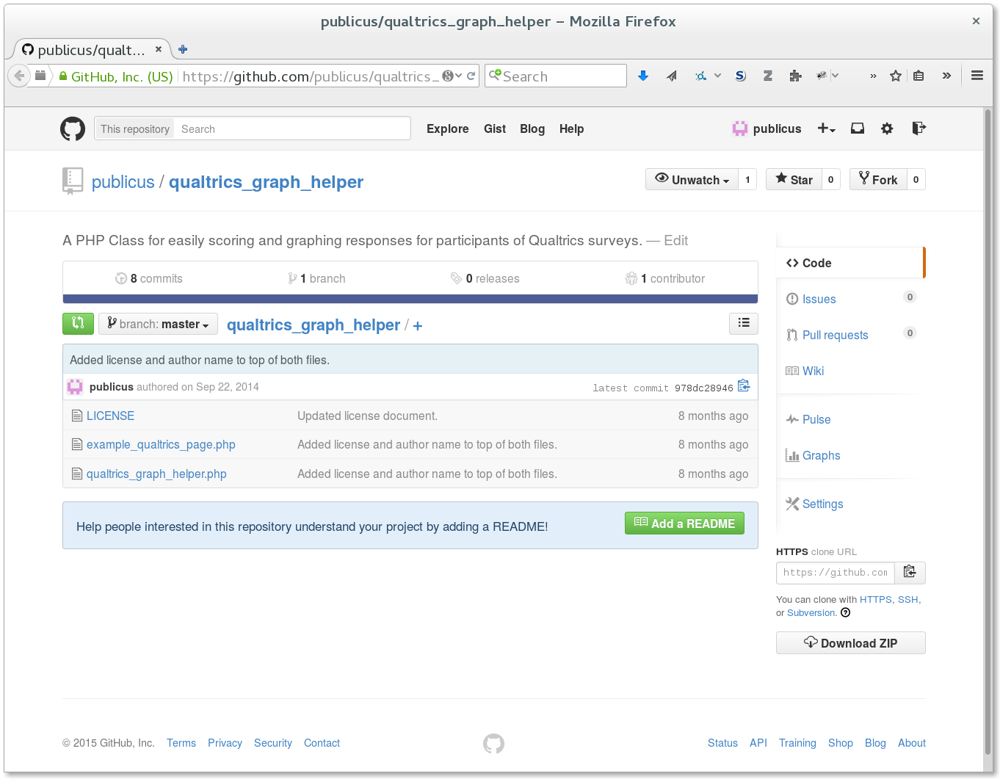
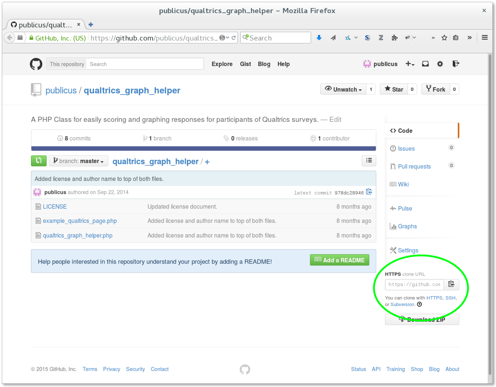
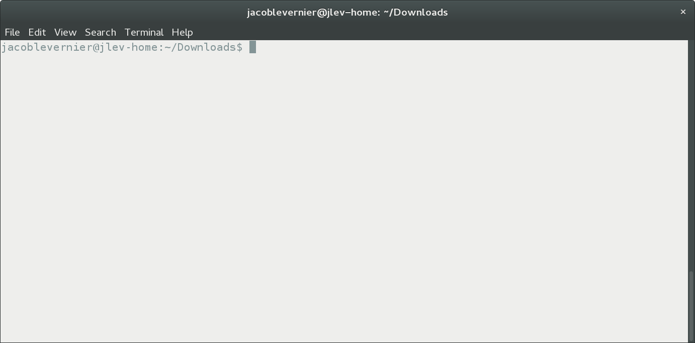
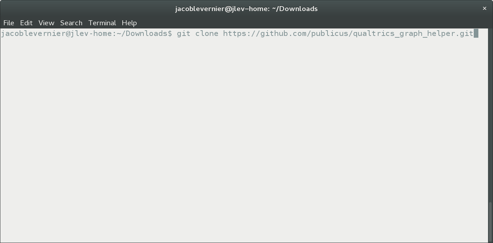
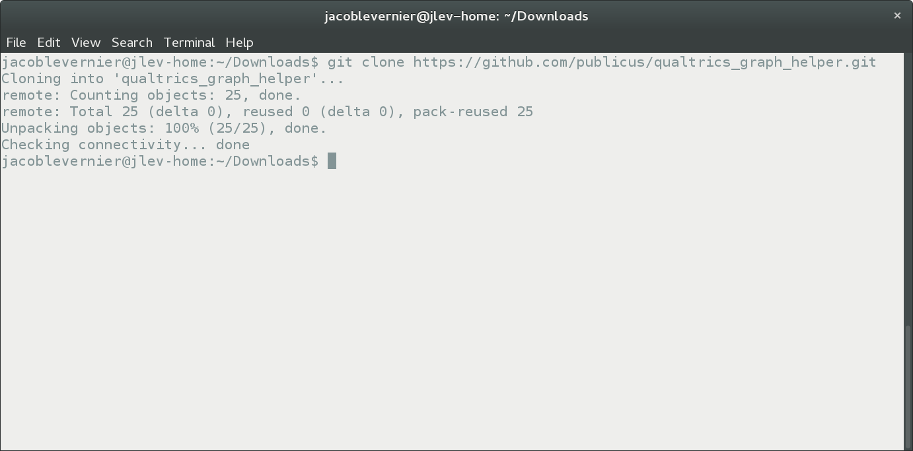
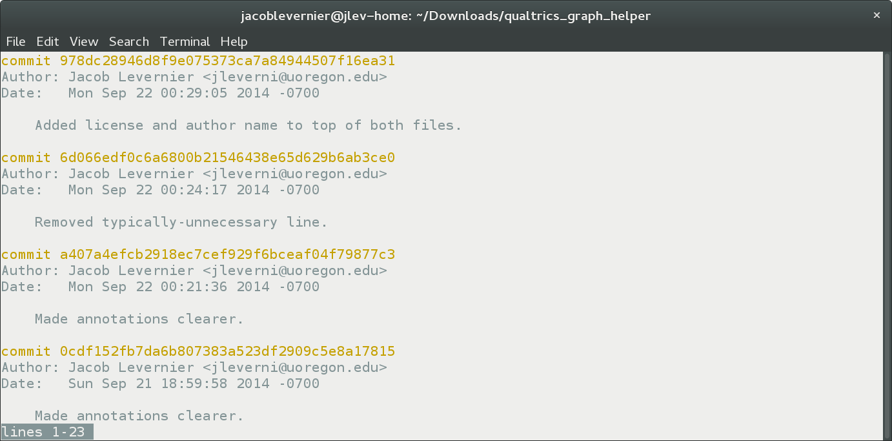
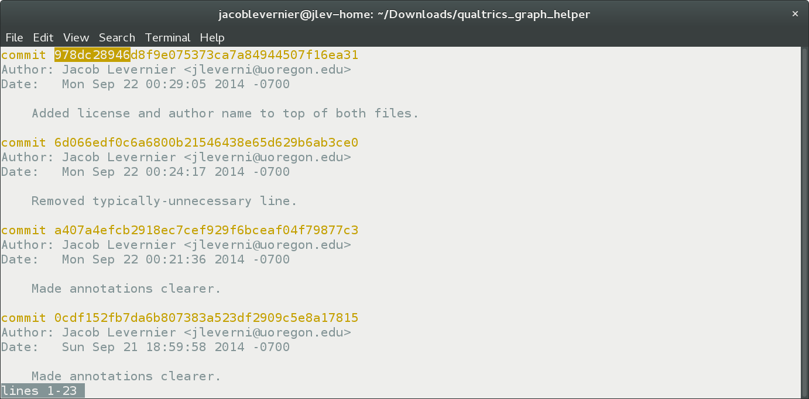
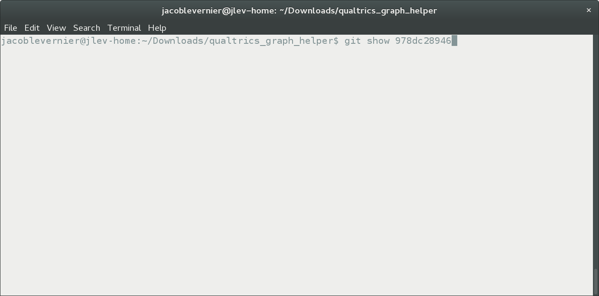
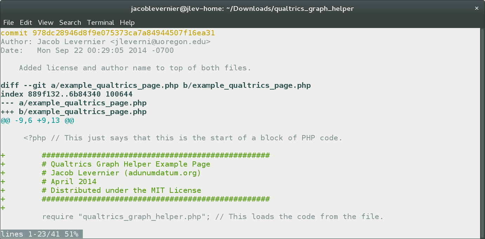

% Time-Travel for Academics
% Jacob Levernier
% May 18, 2015

# Get your digital life in order, and protect yourself from yourself

<!--

This presentation is meant to be used with reveal.js (which you need to download and place in the same directory as these slides). The slides are generated with [Pandoc](http://pandoc.org/demo/example9/producing-slide-shows-with-pandoc.html):  

Rscript -e "library(knitr)" -e "knit('Slides.Rmd', output='markdown_compiled_NOT_FOR_EDITING.mkd')"

pandoc -t revealjs -i -s markdown_compiled_NOT_FOR_EDITING.mkd -o Slides_Build.html --slide-level 2 --css reveal.js/css/theme/white.css --variable transition="fade"

(-i is "incremental" mode for lists. --slide-level sets the header level that should trigger new slides)

(Note that per [here](https://github.com/jgm/pandoc-templates/pull/78), you may need to tempoararily change the css and js locations to not include ".min" in the name (or copy them and rename them with ".min").

-->

<div class="notes">
The point of this talk is to...

"Protect yourself from yourself" means to not have to worry about mistakes that you might make in the future, or about decisions (e.g., to delete something) that you made in the past.
</div>

```{r set_variables, echo = FALSE, eval = TRUE}
Sys.setenv(presentation_base_directory = "/home/jacoblevernier/ownCloudDesktopSyncFolder/Documents/Files in Transit/Time_Travel_for_Academics_Git_Presentation") # Following http://yihui.name/knitr/demo/engines/, this is currently the only way to set variables that can be shared across non-R code chunks that are bash-based (for other engines, variables have to be written to files to be shared across code chunks, apparently).
```

##  

](images/phd_comics_version_control_101212s.gif)

## What to do?

Well...

* **Dropbox** 
	* <span class="fragment highlight-green">Saves (limited) versions of files</span>
	* <span class="fragment highlight-red">No concurrent editing</span>
	* <span class="fragment highlight-red">Doesn't show what was changed between different versions, or why</span>
* **Word Documents**
	* <span class="fragment highlight-red">Passing around a document makes it hard to sync files and to keep track of which versions are based on which others.</span>
* **Google Docs**
	* <span class="fragment highlight-green">Nice collaborative editing with versions</span>
	* <span class="fragment highlight-green">Useful for writing manuscripts</span>
	* <span class="fragment highlight-red">No/Limited offline access to files</span>
	* <span class="fragment highlight-red">Not suited for editing code and analyses</span>

<div class="notes">
**Dropbox** *does* save limited versions of files, but doesn't allow two people to edit files at once, and doesn't show what was changed between different versions, or why.

Saving seperate versions of files (or passing around a **Word Document** makes it hard to sync files or keep track of which versions are based on which others.

Using **Google Docs** offers nice collaborative editing with versions, but if your internet connection is down, you have no or limited access to files. And while Docs are fine for writing manuscripts, they're not so good for editing code and analyses.
</div>

# Git

##  

](images/insurance_keyboard.jpg)

## How it Works

<div style="height:300px;"> </div>

<div class="notes">
Note: Following [this site](http://smallbusiness.chron.com/fair-use-logos-2152.html), Fair Use allows for the reuse of logos if the use is only for identification purposes (e.g., in a newspaper to identify the company the article is about).
</div>

* Distributed (shareable)
* Only saves changes
* You build a "logbook" of everything that's happened to the tracked files.

## The Basic Workflow

1. Make git aware of the files you want to track  
	<span class="fragment">`git init` ("initialize"/start tracking a project)</span>
	<span class="fragment">, `git add` (add to the list of files to track)</span>
	<span class="fragment">, `git clone` (create a copy on your computer of someone else's project)</span>
1. Take a snapshot ("commit") whenever you do something. Add a commit message.  
	<span class="fragment">`git commit --message "I deleted the first part of the Introduction,`  
	`but added new citations to the Literature Review."`</span>
1. Do your work!  
	<span class="fragment">As needed, use `git log` (view the logbook of all previous commits)</span>
	<span class="fragment">, `git diff` (see exactly what changed between two commits)</span>
	<span class="fragment">, and `git checkout` (roll back to a different commit, making the folder look exactly as it did at that point in time — you can always roll back forward later!)</span>

## What to Track with Git

* <span class="fragment highlight-green">Plain-text files</span>
	* Text: .txt, [Markdown](https://daringfireball.net/projects/markdown/syntax), [RMarkdown](http://rmarkdown.rstudio.com/)
	* Code: R, Python, SPSS syntax, etc.
	* Data: csv, corpora, etc.
* <span class="fragment highlight-red">Binary files</span>
	* Videos
	* Compiled software files
	* Images
	* Powerpoint, Word Docs, Excel spreadsheets
* Some users choose to store large files outside of a respository, with a note within the repository pointing to where others can find them.
	* See, e.g., GitHub's [Large File Storage](https://github.com/blog/1986-announcing-git-large-file-storage-lfs) system, or the [`git-media` extension](https://github.com/alebedev/git-media)
* Only track a file if... <span class="fragment">it's changing, and you want to track the changes</span><span class="fragment">, and you want people with whom you share the repository to get a copy of it.</span>

# Real-World Examples

## Code Editing

* Cloning an Existing Repository  
	[Qualtrics Graph Helper](https://github.com/publicus/qualtrics_graph_helper)
* Starting a New Repository from Scratch

## `git clone`



## `git clone`



## 

##  
```{r remove_previously_cloned_repository_files, echo = FALSE, eval = TRUE, engine='bash'}
# rm -rf ~/Downloads/qualtrics_graph_helper
```

```{r clone_repository, echo = TRUE, eval = TRUE, collapse = TRUE, engine='bash'}
cd ~/Downloads
#git clone https://github.com/publicus/qualtrics_graph_helper.git
```
## `git clone`



## `git clone`



##  
```{r git_log, echo = TRUE, eval = TRUE, engine='bash'}
cd ~/Downloads/qualtrics_graph_helper
git log
```

## `git log`


## `git log`



```{r git_show, echo = TRUE, eval = TRUE, engine='bash'}
cd ~/Downloads/qualtrics_graph_helper
git show 978dc28946
```

## `git log`



## `git show`



## `git show`



## Repository from Scratch

```{r git_create_repository_from_scratch, echo = TRUE, eval = TRUE, engine='bash'}
# SET eval=TRUE when you want to set up the example from scratch.

mkdir Git_Example_from_Scratch
cd Git_Example_from_Scratch
git init # Initialize the repository in your current directory

echo -e "# This is an example R script. \nx = 2 + 2 \ny = x + 5" > Example1.R

git add Example1.R
git commit -m "Initial commit, adding a few lines to a new script."

sed --in-place 's/example R script./example script for R./g' Example1.R
echo -e "\nx + 3 # This should equal 4 + 3 = 8" >> Example1.R

git commit -am "Changed comment line, and added an additional line of code."

sed --in-place 's/= 8/= 7/g' Example1.R
git commit -am "Realized that my addition was off in my previous code."

git checkout -b "Exciting_New_Feature"

echo -e "\n# Create a plot \nplot(1:10)" >> Example1.R
git commit -am "Added a plot to the script."

git checkout master
echo -e "\nx + 2 # This should equal 4" >> Example1.R
git commit -am "Added new line of code."

sed --in-place 's/y = x + 5/y = x + 150/g' Example1.R
git commit -am "Changed the code that defines the variable 'y'."

#git checkout Exciting_New_Feature
#echo -e "\n\n # Create a histogram \nhist(rnorm(100, 0, 1))"
#git commit -am "Added a histogram."

#git checkout master
git merge Exciting_New_Feature

# Because we modified the same file in the same places in both branches, we need to tell git to merge them together.
git status
#git add Example1.R
#git commit # This concludes the merge
```

```{r git_add, echo = TRUE, eval = TRUE, engine='bash'}

```

## Manuscript Writing

# The Command Line

## The Bare Essentials

* "Terminal" in Mac OSX and Linux. [Cygwin](https://www.cygwin.com/) in Windows (I haven't tested these command in the Windows Command Prompt, but I think that they should work there too).
* `ls` = **l**i**s**t files in a folder.
* `cd` = "Change Directory"
	* `cd ./subfolder` = "Go into the folder called 'subfolder' in the current directory."
	* `cd ../` = "Go one directory up."
* `man [command]` = "Show me the manual for this command."
	* For example, `man ls` will show and explain all of `ls`'s options.
	* `ls -a` will show hidden files (like the `.git` directory!)
	* `ls -l` will show the files in a list format (with each file on one line)
* This slide is to help you use Git at a basic level. <span class="fragment highlight-red">Do not use command-line commands that you don't know.</span> The command line doesn't ask "Are you sure?"


# GitEye

## 

[GitEye](http://www.collab.net/downloads/giteye)


## `git init`

## `git status`

## `git add`

## `git commit -m "Reminder..."`

## `git log`

## `git checkout`

## `git diff`

# GitHub and Related Services

## What is GitHub?

* See also BitBucket

## Public vs. Private

## `git clone`

## `git push`

## `git pull`

## Branches

## The Reference Log (`git reflog`)


-permissions — possible to keep private or is it automatically public?
-skills needed / learning curve— eg could freshman undergrad with not a lot of computer use expertise be able to learn it easily?
-practicalities — how to download other people’s materials, how to upload our own

