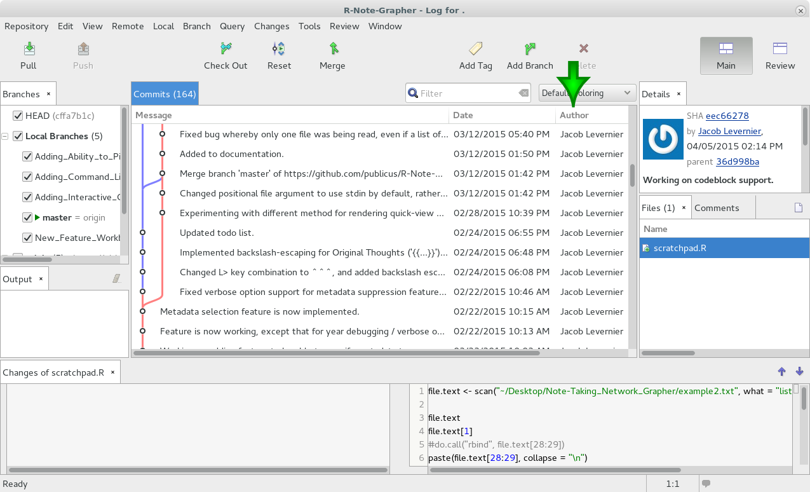

% Time-Travel for Academics
% Jacob Levernier ([adunumdatum.org](http://adunumdatum.org))
% September 18, 2015

<!--
##########
# TODO:
##########

	* Add motivation slide.
	* Why this is relevant (my own story, that this would have saved me a lot of time in my first year, etc.)
		* (This doesn't necessarily need to be on a slide; I previously just explained this quickly while the current title slide was up.)
		* Possibly a brief "Who am I" piece at the beginning.
	* Two goals of the presentation:
		1. Walk away with an immediately-applicable (and not overwhelming) new skill (using Git with the SmartGit GUI (and a word-wrapping diff viewer (Meld for Linux + KDiff3 for Windows and OSX (SourceForge has a 64bit .dmg available. In any case, I should make clear that an external diff viewer is OPTIONAL; I just like one because SmartGit doesn't allow linewrap.), with enough knowledge to use the RefLog if necessary).
		2. Walk away with interest in / knowledge of and excitement about other new skills and tools. These won't have demos, but will be discussed offhand, re: how they work in a real-world workflow:
			* The command line more generally (searching files with grep, using hashtags, etc.)
			* Regular Expressions (good for cleaning, getting a list of hashtags, etc.)
			* RMarkdown (demonstrated with this presentation) (could even have a graph update itself with data about the audience in real-time upon re-compilation at the beginning of the session).
* Add SmartGit initial setup screenshots and instructions.
* Add SmartGit screenshots to replace most command-line screenshots (but not all)
	* I *should* provide the CLI analog to each SmartGit feature, just in a sidebar or something, so that it's available (OR, use the Reveal.js vertical slides to have a potentially non-shown slide *under* each SmartGit slide that uses the current CLI slides).
* Add offhand slides for the extra topics mentioned above.

* Explanations to add (or just be aware of as a presenter):
	* Index vs. Head (if you click "Revert" in SmartGit, you may see this): Index = Changes at the moment of Staging; Head = Last commit/state on the current branch). See http://stackoverflow.com/a/3690522. https://git-scm.com/blog/2011/07/11/reset.html puts it as Head = "last commit snapshot", Index = "proposed next commit snapshot"
	* git reset vs. git checkout: (quotes are from https://www.atlassian.com/git/tutorials/resetting-checking-out-and-reverting/commit-level-operations)
		* git reset: "On the commit-level, resetting is a way to move the tip of a branch to a different commit. This can be used to remove commits from the current branch."
		* git checkout: "Internally, all the above command does is move HEAD to a different branch and update the working directory to match. Since this has the potential to overwrite local changes, Git forces you to commit or stash any changes in the working directory that will be lost during the checkout operation. Unlike git reset, git checkout doesn’t move any branches around."
* Update GitHub Code link to match branch for this specific presentation.

-->

## This Presentation

* The code is on [GitHub](https://github.com/publicus/Time-Travel-for-Academics)
* A copy of the complete presentation is at [http://links.AdUnumDatum.org?time-travel-for-academics-2015-09-18](http://links.AdUnumDatum.org?time-travel-for-academics-2015-09-18)

## Goals

1. Immediately-applicable skill with one new tool (**SmartGit**, supplemented with the command line)
1. Excitement about (but not yet usable understanding of) other tools:
	* **RMarkdown**
	* **The Unix Command Line**
	* **Regular Expressions**

# Get your digital life in order, and protect yourself from yourself

<!--

This presentation is meant to be used with reveal.js (which you need to download and place in the same directory as these slides). The slides are generated with [Pandoc](http://pandoc.org/demo/example9/producing-slide-shows-with-pandoc.html):  

Rscript -e "library(knitr)" -e "knit('Slides.Rmd', output='markdown_compiled_NOT_FOR_EDITING.mkd')"

pandoc -t revealjs -i -s markdown_compiled_NOT_FOR_EDITING.mkd -o Slides_Build.html --slide-level 2 --css reveal.js/css/theme/white.css --variable transition="fade"

You can add the --self-contained flag to pandoc to create a single file (with all images and linked css and javascript files encoded and embedded) for distribution.

(-i is "incremental" mode for lists. --slide-level sets the header level that should trigger new slides)

(Note that per [here](https://github.com/jgm/pandoc-templates/pull/78), you may need to tempoararily change the css and js locations to not include ".min" in the name (or copy them and rename them with ".min").

-->

<div class="notes">
The point of this talk is to...

"Protect yourself from yourself" means to not have to worry about mistakes that you might make in the future, or about decisions (e.g., to delete something) that you made in the past.
</div>

```{r set_variables, echo = FALSE, eval = TRUE}
Sys.setenv(presentation_base_directory = "/home/jacoblevernier/ownCloudDesktopSyncFolder/Documents/Files in Transit/Time_Travel_for_Academics_Git_Presentation") # Following http://yihui.name/knitr/demo/engines/, this is currently the only way to set variables that can be shared across non-R code chunks that are bash-based (for other engines, variables have to be written to files to be shared across code chunks, apparently).
```

##  

](images/phd_comics_version_control_101212s.gif)

## What to do?

Well...

* **Dropbox** 
	* <span class="fragment highlight-green">Saves (limited) versions of files</span>
	* <span class="fragment highlight-red">No concurrent editing</span>
	* <span class="fragment highlight-red">Doesn't show what was changed between different versions, or why</span>
* **Word Documents**
	* <span class="fragment highlight-red">Passing around a document makes it hard to sync files and to keep track of which versions are based on which others.</span>
* **Google Docs**
	* <span class="fragment highlight-green">Nice collaborative editing with versions</span>
	* <span class="fragment highlight-green">Useful for writing manuscripts</span>
	* <span class="fragment highlight-red">No/Limited offline access to files</span>
	* <span class="fragment highlight-red">Not suited for editing code and analyses</span>

<div class="notes">
**Dropbox** *does* save limited versions of files, but doesn't allow two people to edit files at once, and doesn't show what was changed between different versions, or why.

Saving seperate versions of files (or passing around a **Word Document** makes it hard to sync files or keep track of which versions are based on which others.

Using **Google Docs** offers nice collaborative editing with versions, but if your internet connection is down, you have no or limited access to files. And while Docs are fine for writing manuscripts, they're not so good for editing code and analyses.
</div>

# Git

##  

](images/insurance_keyboard.jpg)

## How it Works

<div style="height:300px;"> </div>

<div class="notes">
Note: Following [this site](http://smallbusiness.chron.com/fair-use-logos-2152.html), Fair Use allows for the reuse of logos if the use is only for identification purposes (e.g., in a newspaper to identify the company the article is about).
</div>

* Distributed (shareable)
* Only saves changes
* You build a "logbook" of everything that's happened to the tracked files.

## Command Line vs. Point-and-Click

* We'll talk about both.
* Git is fundamentally a command-line application.
* Programs like SmartGit add a graphical interface.
* **One take-home message of everything after this:** SmartGit can do (pretty much) everything that the command line can.  
<span class="fragment">We'll focus on GUI, but it's smartest to learn about this in parallel with the command line.  
(If you need to look up help later, it'll be useful to have heard the relevant command-line vocab terms)</span>

## The Basic Workflow

1. Make git aware of the files you want to track  
	<span class="fragment">`git init` ("initialize"/start tracking a project),</span>  
	<span class="fragment">`git clone [url]` (create a copy on your computer of someone else's project),</span>  
	<span class="fragment">`git add [filename]` (add to the list of files to track)</span>
	* You use `git add [filename]` to get a file to be tracked in the first place. After that, whenever the file gets modified, you use `git add` to put it into the list of things to snapshot.
1. Take a snapshot ("commit") whenever you do something. Add a commit message.  
	<span class="fragment">`git commit --message "I deleted the first part of the Introduction,`  
	`but added new citations to the Literature Review."`</span>
1. Do your work!  
	<span class="fragment">As needed, use `git log` (view the logbook of all previous commits),</span>  
	<span class="fragment">`git status` to see which files Git sees as having been changed since the last commit,</span>  
	<span class="fragment">`git diff [filename]` (see exactly what changed between two commits),</span>  
	<span class="fragment">`git checkout [id number]` (roll back to a different commit, making the folder look exactly as it did at that point in time — you can always roll forward later! (with `git checkout master` or `git checkout OtherBranchName`)</span>

## What to Track with Git

* <span class="fragment highlight-green">Plain-text files</span>
	* Text: .txt, [Markdown](https://daringfireball.net/projects/markdown/syntax), [RMarkdown](http://rmarkdown.rstudio.com/)
	* Code: R, Python, SPSS syntax, etc.
	* Data: csv, corpora, etc.
* <span class="fragment highlight-red">Binary files</span>
	* Videos
	* Compiled software files
	* Images
	* Powerpoint, Word Docs, Excel spreadsheets
* Some users choose to store large files outside of a respository, with a note within the repository pointing to where others can find them.
	* See, e.g., GitHub's [Large File Storage](https://github.com/blog/1986-announcing-git-large-file-storage-lfs) system, or the [`git-media` extension](https://github.com/alebedev/git-media)

## Interlude: <span class="fragment highlight-green">Text</span>

* Text works across platforms.
* Especially through the Unix Command Line, text is searchable, combinable (able to be re-combined based on searches without changing the original text), and transmutable (able to be changed from format to format).

<div class="notes">
Examples: Go into my academic notes, and show searching using `grep`, inc. with --only-matching, --invert-match. Show writing that to a text file.
</div>

## Interlude: <span class="fragment highlight-green">Text</span>

* Many text editors (such as [SublimeText](http://www.sublimetext.com/ "SublimeText 2") can search for *patterns* of text using "Regular Expressions"
* This presentation is written in plain-text!  
	* It uses a tool called [Pandoc](http://pandoc.org/ "Pandoc"), which can convert plain-text manuscripts into PDFs, .docx, .html, .epub, etc.). The text is written in [Markdown](http://rmarkdown.rstudio.com/ "Markdown")
* With an R package called [Knitr](http://yihui.name/knitr "Knitr") (or with tools built-in to software like [R Studio](http://rstudio.com/ "R Studio")), presentations and manuscripts can contain code that auto-updates their charts and figures.

<div class="notes">
Examples: (No Regex example, as the command could be overwhelming even to see. Just talk about use-cases (e.g., cleaning phone number data).
</div>

## Interlude: Text

```{r Embedded_Code_Example, echo=FALSE, eval=TRUE, fig.cap=""}

data_to_process <- read.csv("Demographic_Data_of_Audience_Participants.csv")

# Create a nice plot. For color palettes, see http://www.r-bloggers.com/color-palettes-in-r/

barplot(
  data_to_process$Number_of_People, # Bar heights
  names.arg = data_to_process$Operating_System, # Labels
  col = cm.colors(4), # Colors
  main = NULL, # Main title
  xlab = "Operating System", # X label
  ylab = c("Number of people today,", format(Sys.Date(), format="%B %d, %Y")) # Y label.
)

```

## A Review...

* Anything can be tracked, but text files are best. 
* Only track a file if... <span class="fragment">it's changing, and you want to track the changes</span><span class="fragment">, and you want people with whom you share the repository to get a copy of it.</span>

# The Command Line

## The Bare Essentials

* "Terminal" in Mac OSX and Linux. [Cygwin](https://www.cygwin.com/) in Windows (I haven't tested these command in the Windows Command Prompt, but I think that they should work there too), or [Git for Windows](https://msysgit.github.io/).
* `ls` = **l**i**s**t files in a folder.
* `cd` = "Change Directory"
	* `cd ./subfolder` = "Go into the folder called 'subfolder' in the current directory."
	* `cd ../` = "Go one directory up."
* `man [command]` = "Show me the manual for this command."
	* For example, `man ls` will show and explain all of `ls`'s options.
	* `ls -a` will show hidden files (like the `.git` directory!)
	* `ls -l` will show the files in a list format (with each file on one line)

## The Bare Essentials

* This slide is to help you use Git at a basic level. <span class="fragment highlight-red">Do not use command-line commands that you don't know.</span> The command line doesn't ask "Are you sure?"

## `git clone`


## `git clone`


## `git clone`


## `git clone`


## `git clone`


## `git log`


## `git log`


(Press 'q' to quit the log viewer)

## `git log`


## `git show`


## `git show`


# SmartGit — Initial Setup

##


##


##


## 


## SmartGit

](images/smartgit_screenshots/smartgit_Initial_View.png)

* See also `GitEye`, `gitk`, `git-cola`, and several other tools. SmartGit is the most straightforward I've found after quite a bit of looking.

## 

SmartGit's Commit Log ("History")

## 

SmartGit's Commit Log ("History")

## 

SmartGit's Commit Log ("History")

## 

SmartGit's Commit Log ("History")

## 

SmartGit's Commit Log ("History")

## 

SmartGit's Commit Log ("History")

## Branches

* A git log is like a big trunk of a tree.
* That tree can have branches.
* "Branch" ≈ A hashtag given to a line of commits
	* E.g., "New_Test_that_Might_Break_Everything"<span class="fragment">, "New_Feature"</span><span class="fragment">, "My_Part_of_the_Project"</span>
* `git branch` = See a list of available branches
* `git checkout [branchname]` = Go to the top of the branch called "branchname"

## 

Branching (`git checkout -b NewBranchName`, or `git checkout ExisitingBranchName`) 

## 

Branching (`git checkout -b NewBranchName`, or `git checkout ExisitingBranchName`) 

## 

Merging (`git checkout MainBranchName; git merge OtherBranchName`)

## 

Merging (`git checkout MainBranchName; git merge OtherBranchName`)

## Comparing Files between Commits (`git diff`)

# GitHub and Related Services

## What is GitHub?

* See also [BitBucket](https://bitbucket.org/ 
"BitBucket") and [GitLab](https://about.gitlab.com/ "GitLab")

## Public vs. Private

* GitHub: Public by default. Pay for private.
* BitBucket: More allowance for private, but still based on pay-for-private model.
* GitLab: Free,	able to be hosted on-site. Can pay for support and extra features.
* **Both GitHub and BitBucket have academic/student accounts that allow for unlimited private repositories.**

## `git push` and `git pull`

* Once you've cloned a repository, all it takes to add your changes to it is to <span style="display:inline-block;" class="fragment grow">**"push"**</span> your local changes up to the server, with `git push https://github.com/url_of_the_repository`
* If you want to get what everyone else has been adding to the repository, you can <span style="display:inline-block;" class="fragment grow">**"pull"**</span> it down from the server, with `git pull` (Git should know where to pull it from automatically from when you cloned it).

## The Reference Log (`git reflog`)

* Is a log of every git command you run.
* Needs to be run from the command line (SmartGit doesn't have a full interface for the reflog).
* Exists on your local machine only, and is wiped after 60-90 days.
* Useful if you mess up a merge, etc.
* To reset as if you hadn't done a command, you can use `git reset [IDNumber]`
	* `git reset --hard 627c93d` will revert back to ID 627c93d, deleting anything you haven't committed yet.
	* `git reset --soft 627c93d` will revert back to ID 627c93d, keeping anything you haven't committed yet.
	* Using `git reset` will add a new entry to the Reference Log, so you can undo it, too! (Although you'd still lose any uncommitted changes)

